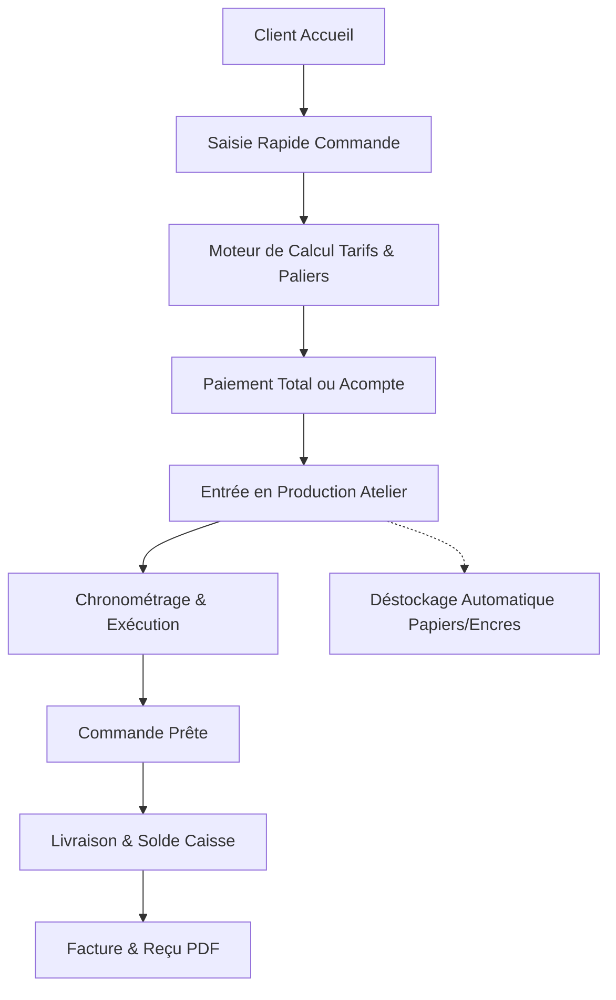
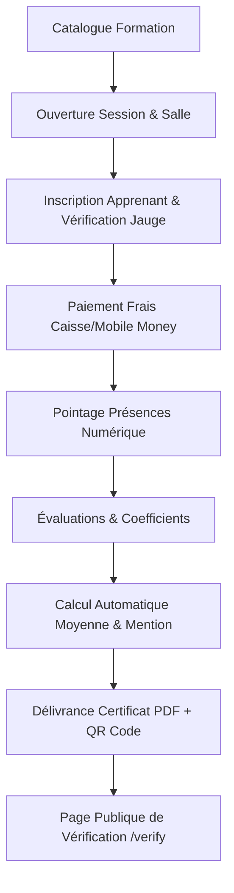
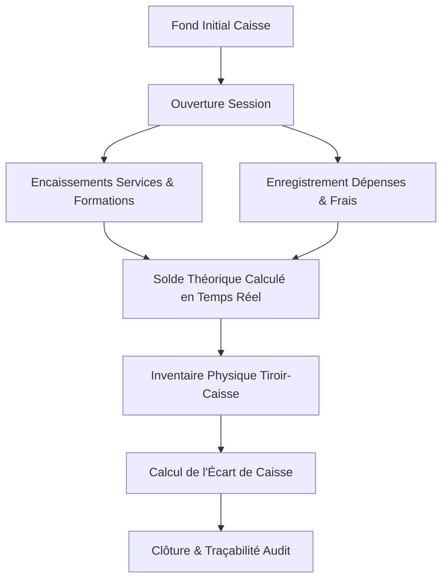

# Centre Management System (CMS) — Cycles Métier & Workflows

## 1. Cycle Métier Pôle Services

```mermaid
graph TD
    A[Client Accueil] --> B[Saisie Rapide Commande]
    B --> C[Moteur de Calcul Tarifs & Paliers]
    C --> D[Paiement Total ou Acompte]
    D --> E[Entrée en Production Atelier]
    E --> F[Chronométrage & Exécution]
    F --> G[Commande Prête]
    G --> H[Livraison & Solde Caisse]
    H --> I[Facture & Reçu PDF]
    E -.-> J[Déstockage Automatique Papiers/Encres]
```

## 2. Cycle Métier Pôle Formation (LMS)

```mermaid
graph TD
    A[Catalogue Formation] --> B[Ouverture Session & Salle]
    B --> C[Inscription Apprenant & Vérification Jauge]
    C --> D[Paiement Frais Caisse/Mobile Money]
    D --> E[Pointage Présences Numérique]
    E --> F[Évaluations & Coefficients]
    F --> G[Calcul Automatique Moyenne & Mention]
    G --> H[Délivrance Certificat PDF + QR Code]
    H --> I[Page Publique de Vérification /verify]
```

## 3. Cycle de Gestion de Caisse

```mermaid
graph TD
    A[Fond Initial Caisse] --> B[Ouverture Session]
    B --> C[Encaissements Services & Formations]
    B --> D[Enregistrement Dépenses & Frais]
    C --> E[Solde Théorique Calculé en Temps Réel]
    D --> E
    E --> F[Inventaire Physique Tiroir-Caisse]
    F --> G[Calcul de l'Écart de Caisse]
    G --> H[Clôture & Traçabilité Audit]
```
